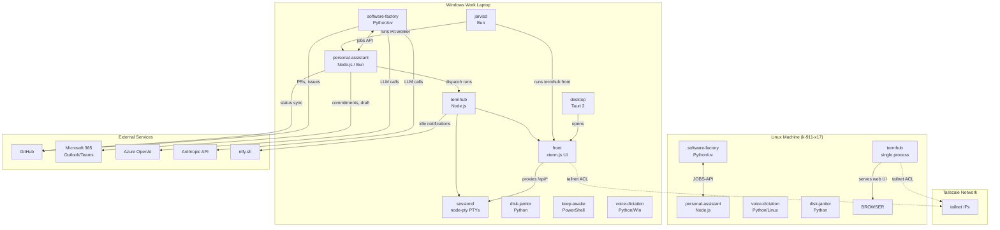
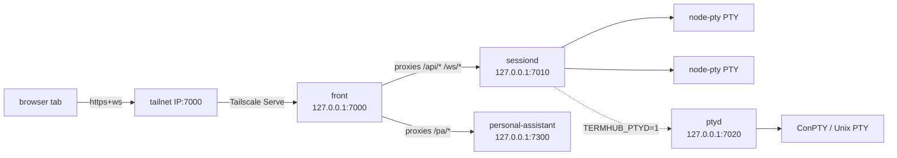
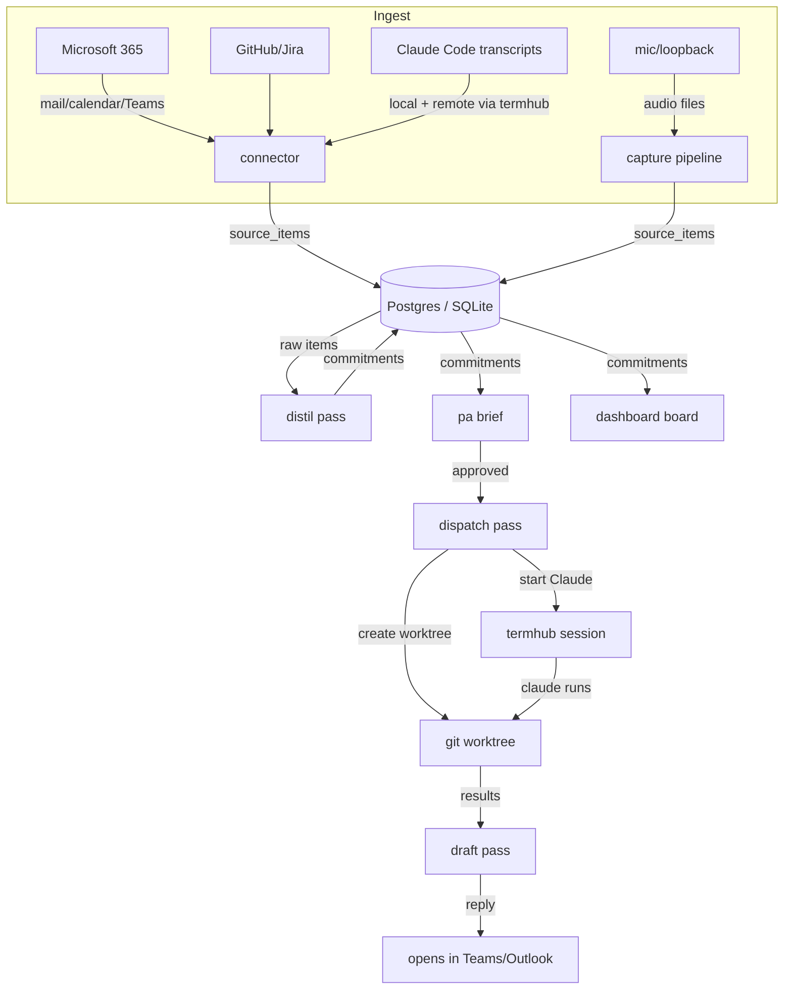
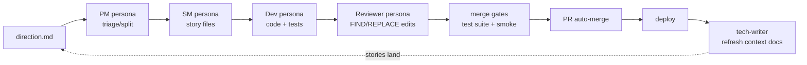
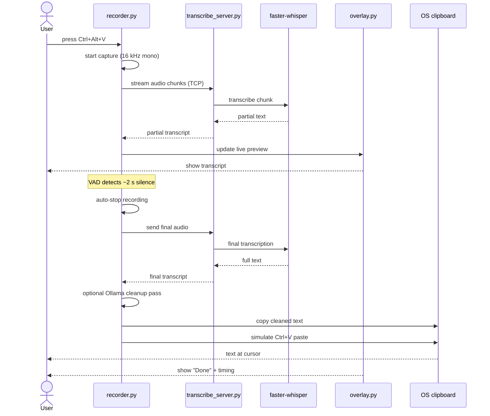

# Architecture Diagrams

## System-level overview

```mermaid
flowchart TB
    subgraph "Windows Work Laptop"
        PA[personal-assistant<br/>Node.js / Bun]
        TH[termhub<br/>Node.js]
        SESSIOND[sessiond<br/>node-pty PTYs]
        FRONT[front<br/>xterm.js UI]
        JD[jarvisd<br/>Bun]
        DJ[disk-janitor<br/>Python]
        KA[keep-awake<br/>PowerShell]
        DT[desktop<br/>Tauri 2]
        SF[software-factory<br/>Python/uv]
        VD[voice-dictation<br/>Python/Win]

        PA -->|dispatch runs| TH
        TH --> FRONT
        TH --> SESSIOND
        FRONT -->|proxies /api/*| SESSIOND
        JD -->|runs PA worker| PA
        JD -->|runs termhub front| FRONT
        DT -->|opens| FRONT
        SF <-->|jobs API| PA
    end

    subgraph "Linux Machine (k-911-x17)"
        TH_L[termhub<br/>single process]
        SF_L[software-factory<br/>Python/uv]
        PA_L[personal-assistant<br/>Node.js]
        VD_L[voice-dictation<br/>Python/Linux]
        DJ_L[disk-janitor<br/>Python]

        SF_L <-->|JOBS-API| PA_L
        TH_L -->|serves web UI| BROWSER
    end

    subgraph "Tailscale Network"
        TS[tailnet IPs]
    end

    FRONT -.->|tailnet ACL| TS
    TH_L -.->|tailnet ACL| TS

    subgraph "External Services"
        GH[GitHub]
        M365[Microsoft 365<br/>Outlook/Teams]
        AZURE[Azure OpenAI]
        ANTHROPIC[Anthropic API]
        NTFY[ntfy.sh]
    end

    PA -->|commitments, draft| M365
    PA -->|status sync| GH
    SF -->|PRs, issues| GH
    SF -->|LLM calls| AZURE
    SF -->|LLM calls| ANTHROPIC
    TH -->|idle notifications| NTFY
```

## termhub two-tier architecture

```mermaid
flowchart LR
    BROWSER[browser tab] -->|https+ws| TS[tailnet IP:7000]
    TS -->|Tailscale Serve| FRONT[front<br/>127.0.0.1:7000]
    FRONT -->|proxies /api/* /ws/*| SESSIOND[sessiond<br/>127.0.0.1:7010]
    FRONT -->|proxies /pa/*| PA[personal-assistant<br/>127.0.0.1:7300]
    SESSIOND --> PTY1[node-pty PTY]
    SESSIOND --> PTY2[node-pty PTY]
    SESSIOND -.->|TERMHUB_PTYD=1| PTYD[ptyd<br/>127.0.0.1:7020]
    PTYD --> CPTY[ConPTY / Unix PTY]
```

## personal-assistant data flow

```mermaid
flowchart TB
    subgraph "Ingest"
        M365[Microsoft 365] -->|mail/calendar/Teams| CONNECTOR[connector]
        GH[GitHub/Jira] --> CONNECTOR
        AUDIO[mic/loopback] -->|audio files| CAPTURE[capture pipeline]
        CLAUDE_SESSIONS[Claude Code transcripts] -->|local + remote via termhub| CONNECTOR
    end

    CONNECTOR -->|source_items| DB[(Postgres / SQLite)]
    CAPTURE -->|source_items| DB

    DB -->|raw items| DISTILL[distil pass]
    DISTILL -->|commitments| DB

    DB -->|commitments| BRIEF[pa brief]
    DB -->|commitments| BOARD[dashboard board]

    BRIEF -->|approved| DISPATCH[dispatch pass]
    DISPATCH -->|create worktree| WORKTREE[git worktree]
    DISPATCH -->|start Claude| TERMHUB[termhub session]
    TERMHUB -->|claude runs| WORKTREE

    WORKTREE -->|results| DRAFT[draft pass]
    DRAFT -->|reply| M365_OPEN[opens in Teams/Outlook]
```

## software-factory chain (Loop 1)

```mermaid
flowchart LR
    DIR[direction.md] --> PM[PM persona<br/>triage/split]
    PM --> SM[SM persona<br/>story files]
    SM --> DEV[Dev persona<br/>code + tests]
    DEV --> REVIEWER[Reviewer persona<br/>FIND/REPLACE edits]
    REVIEWER --> GATES[merge gates<br/>test suite + smoke]
    GATES --> PR[PR auto-merge]
    PR --> DEPLOY[deploy]
    DEPLOY --> TW[tech-writer<br/>refresh context docs]
    TW -.->|stories land| DIR
```

## Primary user flow: voice dictation

```mermaid
sequenceDiagram
    actor User
    participant Recorder as recorder.py
    participant Server as transcribe_server.py
    participant Whisper as faster-whisper
    participant Overlay as overlay.py
    participant Clipboard as OS clipboard

    User->>Recorder: press Ctrl+Alt+V
    Recorder->>Recorder: start capture (16 kHz mono)
    Recorder->>Server: stream audio chunks (TCP)
    Server->>Whisper: transcribe chunk
    Whisper-->>Server: partial text
    Server-->>Recorder: partial transcript
    Recorder->>Overlay: update live preview
    Overlay-->>User: show transcript

    Note over Recorder: VAD detects ~2 s silence

    Recorder->>Recorder: auto-stop recording
    Recorder->>Server: send final audio
    Server->>Whisper: final transcription
    Whisper-->>Server: full text
    Server-->>Recorder: final transcript
    Recorder->>Recorder: optional Ollama cleanup pass
    Recorder->>Clipboard: copy cleaned text
    Recorder->>Clipboard: simulate Ctrl+V paste
    Clipboard-->>User: text at cursor
    Overlay-->>User: show "Done" + timing
```